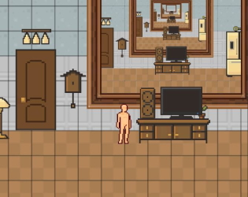

<!--- [Switch to Chinese/切换到中文](/portfolio/index_cn) --->
# Projects
## [PTStudio: Multi-backend 3D Renderer and Editor](https://github.com/dw218192/PTStudio)

<video width="100%" controls>
  <source src="https://github.com/dw218192/PTStudio/assets/31294154/4116308d-ee31-4d20-a449-f130d11fe253" type="video/mp4">
</video>
<video width="100%" controls>
  <source src="https://github.com/dw218192/PTStudio/assets/31294154/6c956cb8-3d53-4e00-8419-cb108d74fecd" type="video/mp4">
</video>
 

## [CUDA Path Tracer](https://github.com/dw218192/Project3-CUDA-Path-Tracer/)

## [BlossomPro: Procedural Flower Modeling Plugin for Maya](https://github.com/dw218192/BlossomPro/)

## [GPUVerb: Interactive sound propagation for dynamic scenes using 2D wave simulation](https://github.com/GPUVerb/GPUVerb)

## [Vulkan Grass Rendering](https://github.com/dw218192/Project5-Vulkan-Grass-Rendering)

## [CUDA Boid Simulation](https://github.com/dw218192/Project1-CUDA-Flocking/)

---
# Technical Art
## [Pen Sketching Shader](https://github.com/dw218192/hw04-stylization)
<video width="100%" controls>
  <source src="https://github.com/dw218192/hw04-stylization/assets/31294154/bf364049-0ecb-4ab2-8273-3aacfc108bfe" type="video/mp4">
</video>
 

## [Houdini LEGO-ified Mesh Generator](https://github.com/dw218192/hw03-legos)

## [Procedural Fireball using WebGL](https://dw218192.github.io/hw01-fireball/)

## [Houdini Jellyfish](https://github.com/dw218192/hw02-jellyfish/)

---

# Itch.io Games
## [No Escape](https://dw218192.itch.io/noescape)

## [Santa Rush](https://dw218192.itch.io/santarush)

## [Mingle](https://dw218192.itch.io/mingle)

---
